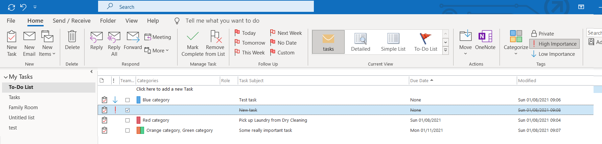
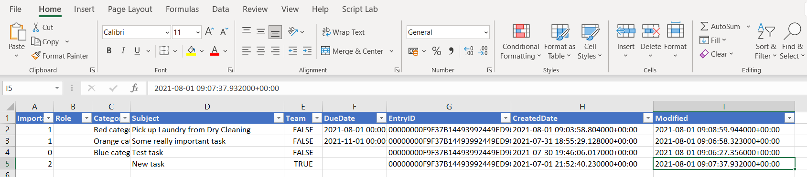

# Sync Outlook Tasks with Excel

Synchronize Outlook Tasks folder with an Excel file.
## Why would I want to do this?

[GTD (Getting things done)](https://en.wikipedia.org/wiki/Getting_Things_Done) and other time / task / personal productivity approaches underline the importance of a Single Todo List, not your email inbox, that is easy to add to and is accessible anywhere.

1) More power than microsoft todo
2) onedrive, bulk edit in excel

Other pluses
* anywhere

Of course not as good - simplcit

images

## Other Useful things you can do 
* Save to Onedrive
* cron job to run automatically

## What this Python Script does

Given a typical Outlook Task folder like this.

  

Synchronize (2 way) with an excel file like the one below. Of course a typically todo / task list could have a hundred (or more items). At least mine does.

## 2 Way Synchonization - Safety first!

By "2 Way" we mean that edits in Outlook or the Excel file get synchonized with each other, back and forward. But for Safety first, we treat the Outlook Task list as the 'gold' copy, and only update from Excel into Outlook if the Modified Column in the spreadsheet has been set to Y.

* We loop through Tasks in Outlook, checking the unique EntryID
    * We search the Excel file (normally task-data.xls) for any Tasks matching this ID
    * We will try to update the Outlook task __Only If__ a matching task in Excel has __Modified set to Y__ 
* We make a backup copy of any previous excel file. e.g. copy task-data.xls to 1task-data.xls, etc
* We then make a template from previous excel sheet (task-data.xls) - delete out all data except the first row. This allows us to keep formatting, filters etc.
* For all Outlook Tasks, we output selected fields to this excel file.
* Following the 'Outlook is Gold' approach, this script
    * Does not delete in Outlook any task deleted in Excel - since we could mistakenly delete a new Outlook task, created after the Excel List was exported.
    * Does not add to Outlook, and task added to Excel - since we could mistakenly add back a task we decided to delete in Outlook

## How to Use

1. Outlook on your machine
1. Python install
1. Download the two files you need into a directory
    * Outlook.py - the actual sync script
    * task-data.xlsx - the file that syncs with outlook

1. Python outlook.py
** By Default - directory, may want to chagne

## Modifying the Script

* Blurb

## Useful technical docs

There is a lot of information on the Web describing PyWin32 - the library used to connect Python to Windows Applications like Python. There is less information on the Object Model within Outlook - and mostly it is intended for VBA and C# users (athough the method calls and params are very similar). Some good starting points used in creating this script:

* https://www.add-in-express.com/creating-addins-blog/2013/06/12/outlook-tasks-create-get-delete/
* https://docs.microsoft.com/en-us/dotnet/api/microsoft.office.interop.outlook.mapifolder?view=outlook-pia
